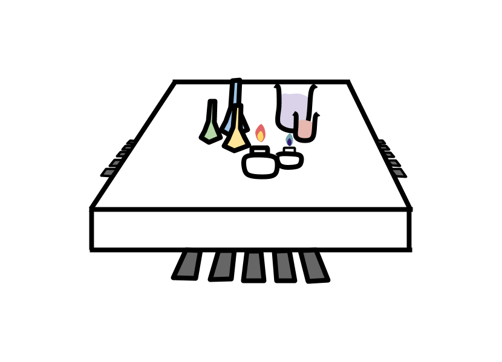

 
# LOAD(lab on a chip)
LOAD(lab on a chip) system control program

## 1. Overview
This program control
+ LED
+ photo diode  
+ BLDC motor 
+ Step motor 
+ Laser 

## 2. Usage
Firstly, you have to import package. 
Then make packet_reactor() object. 
~~~
import protocol

pr = packet_reactor()
~~~

When you receive data from MCU(micro control unit) or transmit data to MCU,
~~~
pr.packet_receive()
pr.packet_transmit(description, data)
~~~

After you receive data by packet_receive() method, object get item like below.
~~~
self.STX
self.Length
self.PID
self.Data
self.CheckSum
self.CheckXor
self.ETX

self.received_data['LED']
self.received_data['PHOTO']
self.received_data['BLDC break']
self.received_data['BLDC direction']
self.received_data['BLDC speed']
self.received_data['BLDC home']
self.received_data['Step moving']
self.received_data['Step position']
self.received_data['Step home']
self.received_data['Laser state']
self.received_data['Battery voltage']
self.received_data['Battery check']
~~~

When you tarnsmit data by packet_transmit() method, you have to use argument like below.
~~~
#LED control
pr.packet_transmit('LED control', '0000011111')

#BLDC motor control
pr.packet_transmit('BLDC motor control', ['Break':'Break disable', 'Direction' : 'CCW', 'Speed' : 10])
pr.packet_transmit('BLDC homing control', 'enable')

#Step motor control
pr.packet_transmit('Step motor control', 1000)

#Laser control
pr.packet_transmit('Laser control', 'On')
~~~
---
# Document 
Here is more detail about usage of library.

---
### <packet_transmit()>
### LED control
~~~
pr = packet_reactor()
pr.packet_transmit('LED control', '0000011111') #argument type is <str>
~~~
This code is an example for turn on LED. 
When you turn on LED, type "LED control" in first argument of create_data_array() method. 
And you type that which LED you want to turn on/off in second argument of create_data_array() method. 
Second argument is state of led which you want to control.
First character of second argument is state of LED_A_1 which is in the PCB board.
Second character of second argument is state of LED_A_2.
Like this...
~~~
'''
Turn off LED_A_1, LED_A_2, LED_B_1, LED_B_2, LED_C_1
and
Turn on LED_C_2, LED_D_1, LED_D_2, LED_E_1, LED_E_2
'''

pr.packet_transmit('LED control', '0000011111')
~~~
---
### 

# json format
~~~
{"BLDC direction": 1, "BLDC break": 1, "BLDC home": 0, "LED": {"LED_D_1": 0, "LED_D_2": 0, "LED_C_2": 0, "LED_C_1": 0, "LED_A_1": 0, "LED_A_2": 0, "LED_B_2": 0, "LED_B_1": 0, "LED_E_1": 0, "LED_E_2": 0}, "Laser state": 0, "Step position": 0, "Step moving": 0, "PHOTO": {"PHOTO_C_2": [128, 0], "PHOTO_C_1": [123, 0], "PHOTO_B_2": [119, 0], "PHOTO_B_1": [117, 0], "PHOTO_E_1": [114, 0], "PHOTO_E_2": [0, 0], "PHOTO_A_1": [120, 0], "PHOTO_A_2": [105, 0], "PHOTO_D_1": [125, 0], "PHOTO_D_2": [0, 0]}, "BLDC speed": 0, "Battery voltage": 184, "Battery check": 0, "Step home": 0}
{"BLDC direction": 1, "BLDC break": 1, "BLDC home": 0, "LED": {"LED_D_1": 0, "LED_D_2": 0, "LED_C_2": 0, "LED_C_1": 0, "LED_A_1": 0, "LED_A_2": 0, "LED_B_2": 0, "LED_B_1": 0, "LED_E_1": 0, "LED_E_2": 0}, "Laser state": 0, "Step position": 0, "Step moving": 0, "PHOTO": {"PHOTO_C_2": [196, 0], "PHOTO_C_1": [194, 0], "PHOTO_B_2": [187, 0], "PHOTO_B_1": [188, 0], "PHOTO_E_1": [195, 0], "PHOTO_E_2": [0, 0], "PHOTO_A_1": [194, 0], "PHOTO_A_2": [170, 0], "PHOTO_D_1": [190, 0], "PHOTO_D_2": [0, 0]}, "BLDC speed": 0, "Battery voltage": 196, "Battery check": 0, "Step home": 0}
{"BLDC direction": 1, "BLDC break": 1, "BLDC home": 0, "LED": {"LED_D_1": 0, "LED_D_2": 0, "LED_C_2": 0, "LED_C_1": 0, "LED_A_1": 0, "LED_A_2": 0, "LED_B_2": 0, "LED_B_1": 0, "LED_E_1": 0, "LED_E_2": 0}, "Laser state": 0, "Step position": 0, "Step moving": 0, "PHOTO": {"PHOTO_C_2": [183, 0], "PHOTO_C_1": [182, 0], "PHOTO_B_2": [177, 0], "PHOTO_B_1": [179, 0], "PHOTO_E_1": [188, 0], "PHOTO_E_2": [0, 0], "PHOTO_A_1": [184, 0], "PHOTO_A_2": [163, 0], "PHOTO_D_1": [186, 0], "PHOTO_D_2": [0, 0]}, "BLDC speed": 0, "Battery voltage": 188, "Battery check": 0, "Step home": 0}
~~~
