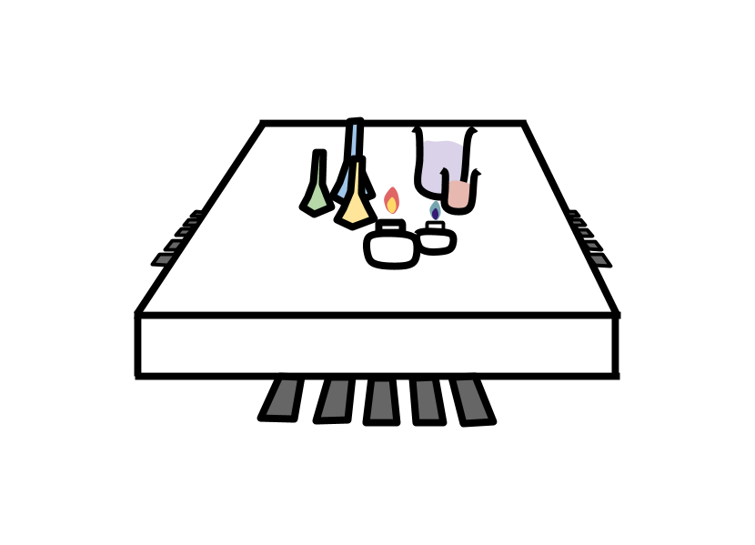

 
# LOAD(lab on a chip)
LOAD(lab on a chip) system control program

## 1. Overview
This program control
+ LED
+ photo diode  
+ BLDC motor 
+ Step motor 
+ Laser 

## 2. Usage
Firstly, you have to import package. 
Then make packet_reactor() object. 
~~~
import protocol

pr = packet_reactor()
~~~

When you receive data from MCU(micro control unit) or transmit data to MCU,
~~~
pr.packet_receive()
pr.packet_transmit(PID, data)
~~~

After you receive data by packet_receive() method, object get item like below.
~~~
self.STX
self.Length
self.PID
self.Data
self.CheckSum
self.CheckXor
self.ETX

self.received_data['LED']
self.received_data['PHOTO']
self.received_data['BLDC break']
self.received_data['BLDC direction']
self.received_data['BLDC speed']
self.received_data['BLDC home']
self.received_data['Step moving']
self.received_data['Step position']
self.received_data['Step home']
self.received_data['Laser state']
self.received_data['Battery voltage']
self.received_data['Battery check']
~~~

When you tarnsmit data by packet_transmit() method, you have to use argument like below.
~~~
#LED control
pr.create_data_array('LED control', '0000011111')

#BLDC motor control
pr.create_data_array('BLDC motor control', ['Break':'Break disable', 'Direction' : 'CCW', 'Speed' : 10])
pr.create_data_array('BLDC homing control', 'enable')

#Step motor control
pr.create_data_array('Step motor control', 1000)

#Laser control
pr.create_data_array('Laser control', 'On')
~~~

